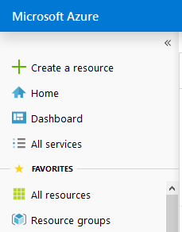
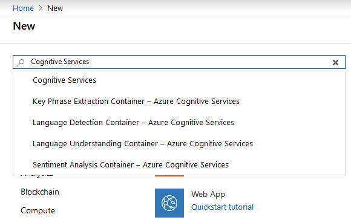
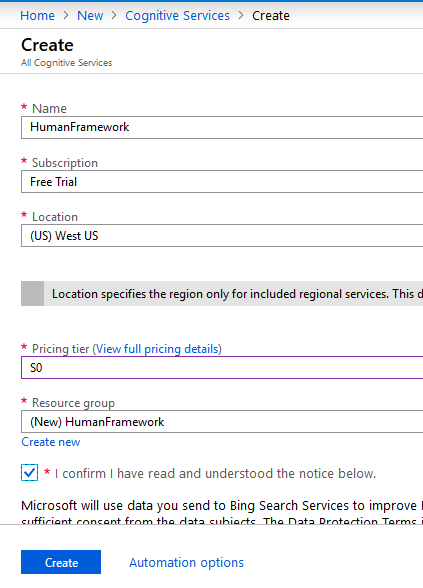
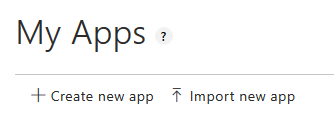
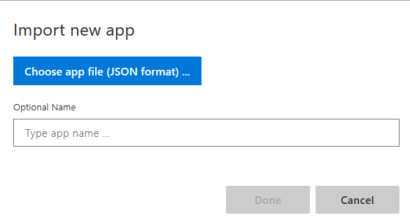
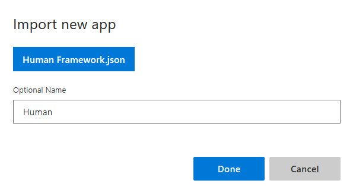
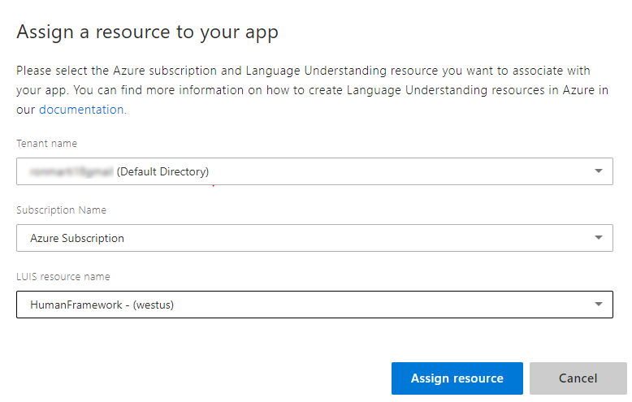

# Human Framework: Test Automation Framework for Humans™

Human Framework is a test automation framework that uses Natural Language Understanding (NLU).
It currently depend on [Microsoft LUIS (Language Understanding)](https://www.luis.ai/) for Intent Classification.

Human Framework makes writing test cases easier by letting testers write test cases without the hassle of memorizing
any programming keyword and using the language they are comfortable with - the human language.

LUIS (and other NLU software) makes it possible to write test cases on any written language. 
Current version only support English. 

On a business setup, Human Framework lessens the need for testers who can write programs, reducing technical requirements.
This makes testers think like end-users.

Human Framework was inspired by [Robot Framework](https://robotframework.org/) but leans towards 
Natural Language Processing (NLP) for writing test cases.

## Usage

### Create an Azure account

1. Go to [Azure portal](https://portal.azure.com) and create an account.
2. On the Azure portal dashboard, click `Create a resource`, look for `Cognitive Services` and click `Create`

    
    
    
    
    
    
3. Fill up form

    

### Create a LUIS.ai account

1. Download the Human Framework training data from https://github.com/roniemartinez/HumanFramework/blob/master/train/en.json
2. Go to [LUIS.a](https://luis.ai) and create an account
3. Click `Import new app`

    
    
4. Click `Choose app file (JSON format) ...` and select the downloaded Human Framework training data

    
    
5. Optionally, type your desired app name

    
    
6. Click `Done`
7. On the application dashboard, click `Train` to train your LUIS.ai app

### Connecting Azure account to LUIS.ai and publishing

1. Click `MANAGE` > `Keys and Endpoints` > `Assign resource`

    
    
2. Fill form

    
    
3. Click `Publish`, select `Environment` and then click the `Publish` button

    
    
4. Go back to `Keys and Endpoints` and select the environment you used to publish your app (labeled `URL referencing slot`)
5. Copy the endpoint assigned resource in #2

### Installing Human Framework

Human Framework is written in Python. Start by downloading Python from [python.org](https://python.org) and install 
Human Framework using the following command in terminal/cmd:

```bash
pip install -e git+git@github.com:roniemartinez/HumanFramework.git#egg=humanframework
```

### Setting up Human Framework

Use the copied endpoint from LUIS.ai and setup Human Framework
 
```bash
human config --luis-endpoint <endpoint>
```

Note that in order to install Human Framework, **access to the Github private repository is REQUIRED**.

### Installing Drivers

Human Framework depends on [Selenium](https://www.seleniumhq.org/) for testing web applications. Download your desired 
[webdriver](https://www.seleniumhq.org/about/platforms.jsp) and extract them to your local working directory.

### Writing tests

Write a text file (.txt) containing your tests. For example, if we have a file named `test_web.txt`:

```text
open chrome https://python.org
page title should be "Welcome to Python.org"
close browser
```

### Running tests

To run the tests in `test_web.txt`, enter the following on the terminal/cmd:

```bash
human --test test_web.txt
```

### Test autodiscovery

Files inside the `trial` folder that starts with the text `test_` are automatically executed.

```text
trial
|- test_simple.txt
|- test_simple_2.txt
|- ...
```

With this structure, you can simple type `human` to run the test cases.

## Author

- [Ronie Martinez](mailto:ronmarti18@gmail.com)
