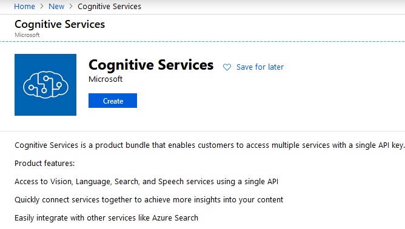

# Human Framework: Test Automation Framework for Humans™

> NOTICE: Human Framework is still on the **Proof-of-Concept** stage

> CONTRIBUTE! I am releasing Human Framework under GPLv3 which makes it open source and free.
> 1. Localization of training data (translation)
> 2. Adding more intents and actions
> 3. Reporting bugs
> 4. Suggesting new features

> NOTICE: I am working on a [RASA NLU](https://rasa.com/docs/rasa/nlu/about/) support

Human Framework is a test automation framework built on top of Natural Language Understanding (NLU) tools.
It currently depend on [Microsoft LUIS (Language Understanding)](https://www.luis.ai/) for Intent Classification.

Human Framework makes writing test cases easier by letting testers write test automation without the hassle of memorizing
any programming keyword and using the language they are comfortable with - the human language.

LUIS (and other NLU tools) makes it possible to write test cases on any human language. 
Current version of Human Framework only supports English. 

On a business setup, Human Framework lessens the need for testers who can write programs to perform test automation,
reducing technical requirements. This makes testers think like end-users.

Human Framework was inspired by [Robot Framework](https://robotframework.org/) but leans towards 
Natural Language Processing (NLP) for writing test cases.

## How it works


The architecture of Human Framework can be simplified into 2 steps- Intent Classification and Action Execution:

1. Human Framework reads the test case files and then uses an Intent Classifier (e.g. LUIS.ai) to identify intents and entities.
For example, the sentence "**open chrome browser**" will be identified with the intent "**web.open_browser**" and entity "**chrome**" as the browser type.
2. Human Framework then executes the action specific for the classified intent. 
For example, the intent "**web.open_browser**" will use [Selenium](https://www.seleniumhq.org/) to automate opening a chrome browser.

## Usage

### Create an Azure account

1. Go to [Azure portal](https://portal.azure.com) and create an account.
2. On the Azure portal dashboard, click `Create a resource`, look for `Cognitive Services` and click `Create`

    
    
    
    
    
    
3. Fill up form

    

### Create a LUIS.ai account

1. Download the Human Framework training data from https://github.com/roniemartinez/HumanFramework/blob/master/train/en.json
2. Go to [LUIS.ai](https://luis.ai) and create an account
3. Click `Import new app`

    
    
4. Click `Choose app file (JSON format) ...` and select the downloaded Human Framework training data

    
    
5. Optionally, type your desired app name

    
    
6. Click `Done`
7. On the application dashboard, click `Train` to train your LUIS.ai app

### Connecting Azure account to LUIS.ai and publishing

1. Click `MANAGE` > `Keys and Endpoints` > `Assign resource`

    
    
2. Fill form

    
    
3. Click `Publish`, select `Environment` and then click the `Publish` button

    
    
4. Go back to `Keys and Endpoints` and select the environment you used to publish your app (labeled `URL referencing slot`)
5. Copy the endpoint assigned resource in #2

### Installing Human Framework

Human Framework is written in Python 3. Start by downloading/installing Python from [python.org](https://python.org). 
 
To install Human Framework, enter the following command into the terminal/cmd:

```bash
pip install -e git+git@github.com:roniemartinez/HumanFramework.git#egg=humanframework
```

### Setting up Human Framework

Use the copied endpoint from LUIS.ai and setup Human Framework
 
```bash
human config --luis-endpoint <endpoint>
```

### Installing Drivers

Human Framework depends on [Selenium](https://www.seleniumhq.org/) for testing web applications. Download your desired 
[webdriver](https://www.seleniumhq.org/about/platforms.jsp) and extract them to your local working directory.

### Writing tests

Write a text file (test_*.txt) containing your tests. For example, if we have a file named `test_web.txt`:

```text
open chrome https://python.org
page title should be "Welcome to Python.org"
close browser
```

### Running tests

To run the tests in `test_web.txt`, enter the following on the terminal/cmd:

```bash
human --test test_web.txt
```

### Test autodiscovery

Files inside the `trial` folder that starts with the text `test_` are automatically executed.

```text
trial
|- test_simple.txt
|- test_simple_2.txt
|- ...
```

With this structure, you can simply type `human` to run the test cases.

## The future of Human Framework

- **Integrated Editor** - While testing was greatly simplified because Human Framework will just execute sentences, 
using the terminal to install Python and several libraries is still more developer-centric.
To remove this technical requirement, another major goal of the Human Framework project is to release a 
one-click installer which should include new features like an integrated IDE/Editor. 
This will greatly increase tester's productivity.
- **Language Support** - Not all testers use the English language. Supporting most languages will benefit more testers around the world. 
- **NLU Options** - While LUIS.ai is very simple to use and accurate compared to other Intent Classifiers, it is not cheap.
To support more testers, a free option like [Rasa NLU](https://rasa.com/docs/rasa/nlu/about/) can be used as an alternative.

## Limitations

I only implemented a few intents and actions for the proof-of-concept stage.
To know what are the possible tests that you can do with Human Framework, check the contents of `trials` and `tests` folders.

## Author

- [Ronie Martinez](mailto:ronmarti18@gmail.com)
